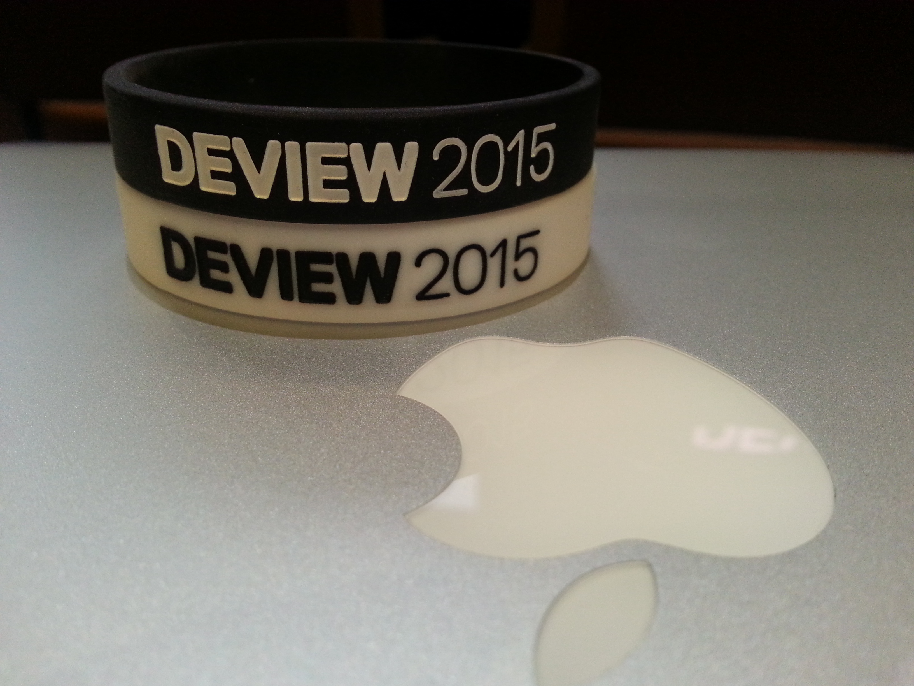
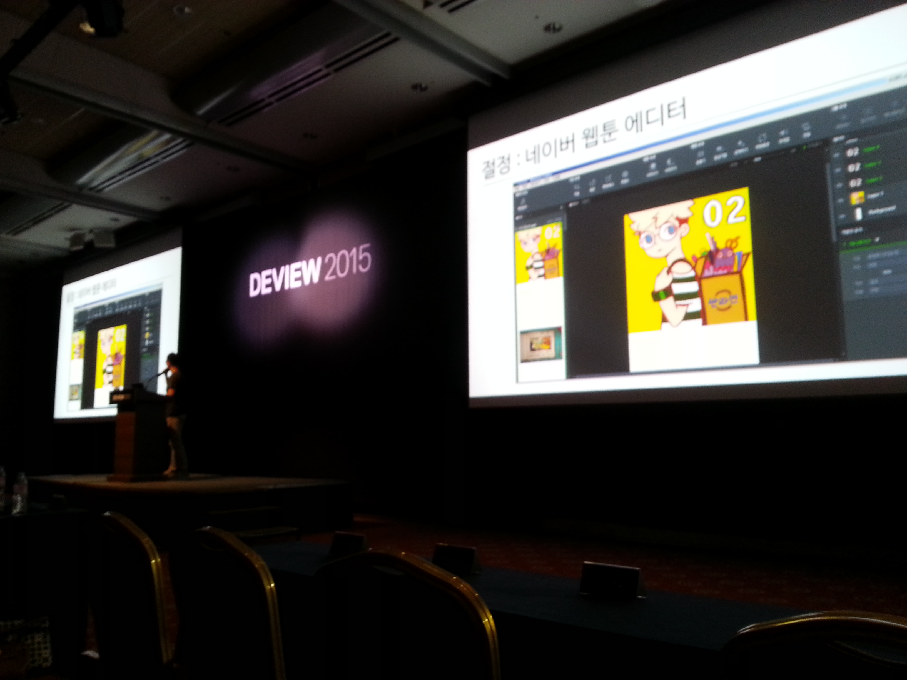
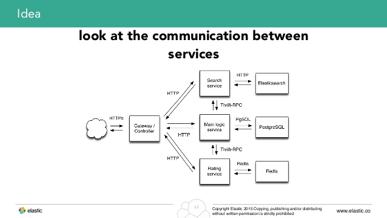
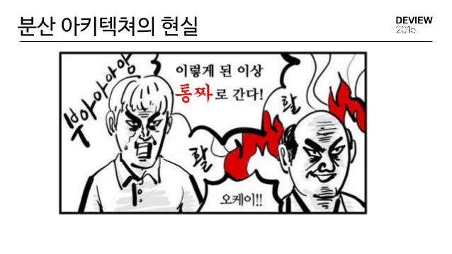
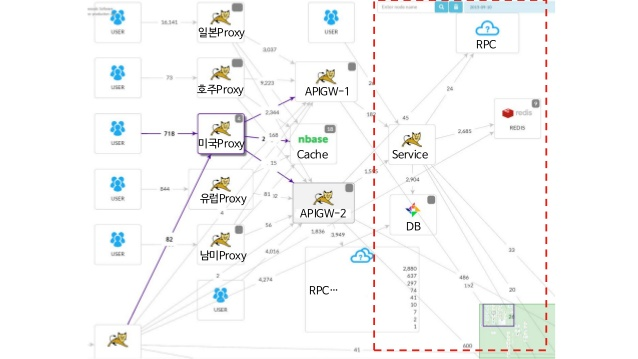
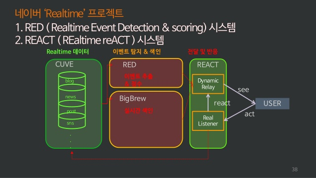
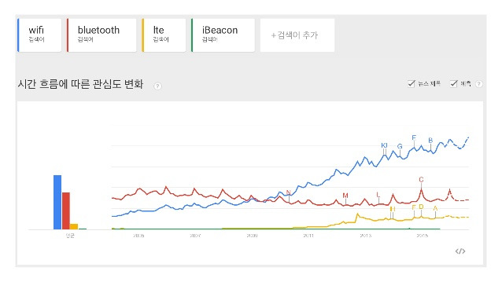
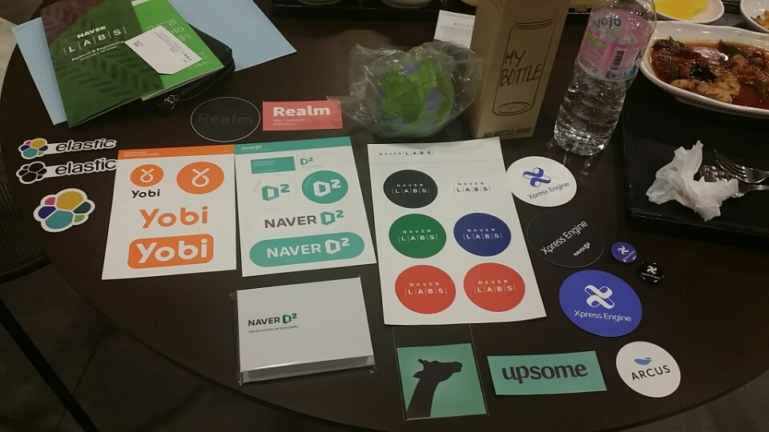

# Deview 2015

2015년 9월 14, 15일 개최된 DEVIEW 2015 개발자 콘퍼런스 참여 휴기

## Deview 란?
### "내일을 향한 개발자의 시선 Developer's View"
### 지식을 나누고, 탁월함을 추구하며, 함께 성장한다.

* Technical-Excellence
* Share
* Growth

# 1일차 - 2015-09-14
## 키노트
* 송창현 네이버 CTO
* 기술 혁신, 돈 보단 조직문화가 중요하다.
* 수평적, 유연한 구조, 몰입

"문화는 씨앗을 뿌리고 물을 주며, 잘 보호하면서 키워야 한다. 후에 큰 나무가 되면 보이지 않게 사라지게 될 것이고 공기처럼 당연하게 느껴지게 된다. 이렇게 되기까지 10년에서 20년이 걸린다."

## 네이버 효과툰은 어떻게 만들어졌나?, 네이버 효과툰 구현 이야기

* 프로젝트의 A-Z까지 참여하는 개발자들의 이야기
* Node Webkit, Angularjs
* 다양한 언어, 오픈소스

## Packetbeat과 Elasticsearch를 이용한 실시간 모니터링

* ELK
* Packetbeat (유료 ㅠㅠ)

## React Everywhere
* React Hello World
* React babel Webpack
* React Hot Loader !

## 웹 브라우저 감옥에서 살아남기
* canvas vs svg
* 스크래치랑 다른 점은?
* 학생의 코드도 분석하겠다!

## 대교모 분산환경에 최적화된 APM:Pinpoint

* 티셔츠 한장을 얻어서...
* 아직은 JAVA 만 지원

# 2일차 - 2015-09-15
## 네이버 검색과 데이터마이닝

* 기술과의 싸움 LDA
* 목적이 기술을 이끈다.
* 랭킹 시스템 -> 통계, KDD(Knowledge Discovery in Databases), 머신러닝 의 상호보완
* 도메인을 이해한다.
* 좋은 데이터 마이너가 되기 위해 필요한 것들!
* 네이버 실시간 데이터마이닝 프로젝트 - 스냅폴라, RED, REACT
* 목표는 지금 일어나는 모든 일

## Docker Orchestration
* 콜록 콜록..배포 9년 하니 몸이 망가졌어요.
* 도커 이야기는 없다! 배포 이야기만 있을 뿐

## WIFI를 이용한 실내 장소 인식하기
* sound, bluetooth, WIFI, Magnetic, Accelerometor, Light

## Netflix 빅데이터 플랫폼 + Apache Spark 통합 경험기
* Spark! 어렵다.

# 느낌

