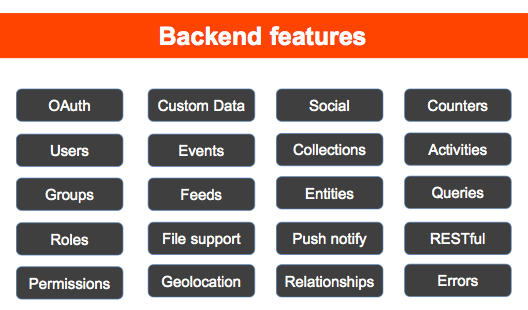

# SA Seminar Firebase
> ### Building Realtime Applications with Firebase


## 사용 배경
> Github-Trend-Kr 작성자들의 프로젝트 선택과 작성자들이 진행한 프로젝트 통계를 위해 제작

* 최초 heroku를 이용해 [github-trend-kr-starter](http://github-trend-kr-starter.herokuapp.com/) 프로젝트 시작
* herku 무료 계정 - 30분 뒤 자동 sleep 모드, 6시간의 sleep상태가 필수
* Realtime 구현을 위해 Websocket 사용 & 사용자 정보 확인을 위한 깃헙 OAuth

## [Google I/O 2015 Extended](http://festi.kr/festi/2015-io-extended-seoul/)
AngularJS와 Firebase를 이용해 서비스 구축하기

## BaaS (Backend as a Service)
> backend 프로그램을 Service로 제공



## firebase
> 채팅 서비스로 시작

> 채팅을 온라인상에서 데이터 sync를 맞추는데 사용자들이 이용하자 개발자들이 이를 반영해줌

> 3년만에 구글에 인수

#### firebase features

* User Authentication
> Google  
> Facebook  
> Twitter  
> Github  

* Realtime Database
> json 형식


* Static Hosting
> firebase tools

* Platforms
> Android, iOS, Web, Rest api


## Quickstart

#### Install Firebase
```javascript
<script src="https://cdn.firebase.com/js/client/2.2.7/firebase.js"></script>
```

#### Read & Write
```javascript
var myFirebaseRef = new Firebase("https://<YOUR-FIREBASE-APP>.firebaseio.com/");

// Write
myFirebaseRef.set({
  title: "Hello World!",
  author: "Firebase",
  location: {
    city: "San Francisco",
    state: "California",
    zip: 94103
  }
});

// Read
myFirebaseRef.child("location/city").on("value", function(snapshot) {
  alert(snapshot.val());  // Alerts "San Francisco"
});
```

## sample project

#### [teamsego.github.io/github-trend-kr-starter](http://teamsego.github.io/github-trend-kr-starter/)
#### [dazzling-heat-8529.firebaseapp.com](https://dazzling-heat-8529.firebaseapp.com/)
