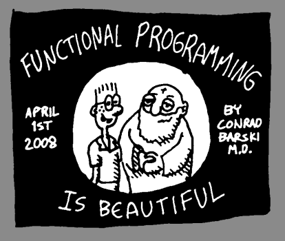
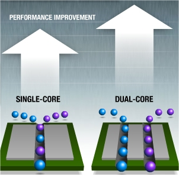

# Functional Programming


<br/><br/><br/><br/><br/><br/><br/><br/><br/><br/>

<br/><br/><br/><br/><br/><br/><br/><br/><br/><br/>
### [임백준 - 함수형 프로그래밍이라는 유령](http://www.cnet.co.kr/view/18272)
* 지금은 프로그래머에게 공기처럼 자연스럽고 상식적인 객체지향이 1980년대에는?
* 1990년대 GUI - 일정한 명령의 나열에 불과한 절차적인 언어만으로는 그들 사이에 존재하는 관계, 상호작용, 속성 등을 표현하기 힘듬.
* CPU 벽에 부딕치다. 무어의 법칙이 깨지다.
* 동시성! 병렬처리!
* 새로운 패러다임..

<br/><br/><br/><br/><br/><br/><br/><br/><br/><br/>

# 함수형 프로그래밍이란?

### [함수형 프로그래밍 - wikipedia](https://ko.wikipedia.org/wiki/%ED%95%A8%EC%88%98%ED%98%95_%ED%94%84%EB%A1%9C%EA%B7%B8%EB%9E%98%EB%B0%8D)
* 함수형 프로그래밍은 상태와 가변 데이터를 멀리하는 프로그래밍 패러다임.
* 계산을 수학적 함수의 조합으로 생각하는 방식.
* 일반적인 프로그래밍 언어에서 함수가 특정 동작을 수행하는 역할을 담당하는 것과는 반대되는 개념.

#### 특징?
* First-class citizen function
* Pure function
* immutable data structures


#### 명령형의 함수
- 프로그램의 상태의 값을 바꿀 수 있는 부작용이 생길 수 있음.
- 참조 투명성이 없고, 같은 코드라도 실행되는 프로그램의 상태에 따라 다른 결과 값을 낼 수 있음.

#### 함수형의 함수
- 출력값은 그 함수에 입력된 인수에만 의존, 인수 x에 같은 값을 넣고 함수 f를 호출하면 항상 f(x)라는 같은 결과값이 나옴.
- 부작용을 제거하면 프로그램의 동작을 이해하고 예측하기가 훨씬 쉽움.

> 참조 투명성

> 부작용(side-effect)

```java
x = x + 1;
```

```java
x = 5;
x = x + 1; // this means 6
x = x + 1; // this means 7
```

<br/><br/><br/><br/><br/><br/><br/><br/><br/><br/>

# [번역-함수형 프로그래밍 기초](http://kwangshin.pe.kr/blog/2013/01/21/%EB%B2%88%EC%97%AD-%ED%95%A8%EC%88%98%ED%98%95-%ED%94%84%EB%A1%9C%EA%B7%B8%EB%9E%98%EB%B0%8Dfunctional-programming-%EA%B8%B0%EC%B4%88/)



```text
"함수형 프로그래밍은 대입문(assignment statements) 없이 프로그래밍을 하는 것이다."
```

####  1부터 25까지 제곱을 구하는 프로그램
```java
public class Squint {
    public static void main(String args[]) {
        for (int i=1; i<=25; i++)
            System.out.println(i*i);
    }
}
```

```clojure
(take 25 (squares-of (integers)))
```
<br/><br/><br/><br/><br/><br/><br/><br/><br/><br/>
### 참조 투명성(REFERENTIAL TRANSPARENCY)

```clojure
(take 25 (squares-of (integers)))
```

```clojure
(take 25 (squares-of (1 2 3 4 5 6 ...)))
```

```clojure
(take 25 (1 4 9 16 25 36 49 64 ...))
```

```c
int k = 1;
int f(int x)
{
  k *= 3;
  return x * 3;
}
int main(int argc, char *argv[])
{
  int x = k + f(k);
  int y = k + f(k);

  printf("%s\n", x == y ? "Equal!" : "Not Equal!");
}
```
```text
f(x) = X^2 + x + 1

k = 1
x = k + f(x)
y = k + f(x)
x == y ?
```
<br/><br/><br/><br/><br/><br/><br/><br/><br/><br/>

<br/><br/><br/><br/><br/><br/><br/><br/><br/><br/>
# [프로그래밍에서 SIDE EFFECT](http://story.wisedog.net/%ED%94%84%EB%A1%9C%EA%B7%B8%EB%9E%98%EB%B0%8D%EC%97%90%EC%84%9C-side-effect-%EB%9E%80/)

### ISO/IEC 14882는 side effect라는 용어를 다음과 같이 정의

> Accessing an object designated by a volatile lvalue, modifying an object, calling a library I/O function, or calling a function that does any of those operations are all side effects, which are changes in the state of the execution environment.

```
x = 3 + 4;
```
```
y = x++
```

### Side Effect 자체는 아무 문제가 안되지만, 프로그래머가 이를 고려하지 않고 사용했을 경우 의도하지 않은 결과가 나올 수 있다.
<br/><br/><br/><br/><br/><br/><br/><br/><br/><br/>
# 3. FRP 에서 함수형 프로그래밍


- map, filter, reduce 등 고계 함수들..

<br/><br/><br/><br/><br/><br/><br/><br/><br/><br/>
# 참고 문서
- [임백준 - 함수형 프로그래밍이라는 유령](http://www.cnet.co.kr/view/18272)
- [번역-함수형 프로그래밍 기초](http://kwangshin.pe.kr/blog/2013/01/21/%EB%B2%88%EC%97%AD-%ED%95%A8%EC%88%98%ED%98%95-%ED%94%84%EB%A1%9C%EA%B7%B8%EB%9E%98%EB%B0%8Dfunctional-programming-%EA%B8%B0%EC%B4%88/)
- [functional-programming-35408801](http://www.slideshare.net/NewH3art/functional-programming-35408801)
- [프로그래밍에서-side-effect-란](http://story.wisedog.net/%ED%94%84%EB%A1%9C%EA%B7%B8%EB%9E%98%EB%B0%8D%EC%97%90%EC%84%9C-side-effect-%EB%9E%80/)
- [왜 함수형 프로그래밍은 (아직) 뜨지 못했나]( http://functionalthinking.appspot.com/%EC%99%9C_%ED%95%A8%EC%88%98%ED%98%95_%ED%94%84%EB%A1%9C%EA%B7%B8%EB%9E%98%EB%B0%8D%EC%9D%80_(%EC%95%84%EC%A7%81)_%EB%9C%A8%EC%A7%80_%EB%AA%BB%ED%96%88%EB%82%98)
- [FRP 소개](http://www.enshahar.me/2014/07/frp.html)
- [클로져 소개](http://www.slideshare.net/SangKyuPark1/ss-18350615)
- [RXjava wiki](https://medium.com/@LIP/rxjava-wiki-home-6f6bbc1f40fc#.mgz004a3f)
