# play.node(2015);

### 2015 - http://playnode.io/
### 2012 - http://nodeconf.kr/2012/


# welcome
### Speaker - Outsiter

### - 2012년은 Nodejs를 소개하는 자리!
### - 2015년은 실제 Production으로 사용하고 있는 경험, 노하우를 공유해보자!

### 최근 Node.js의 큰 변화

v0.12.x 에서 순식간에 v4.2.2 LTS 로 그리고 v5.0.0 Stable 까지.

### Node.js 한국 커뮤니티 http://nodejs.github.io/nodejs-ko/

# Modular vs Monolith
### Speaker - Tim Oxley

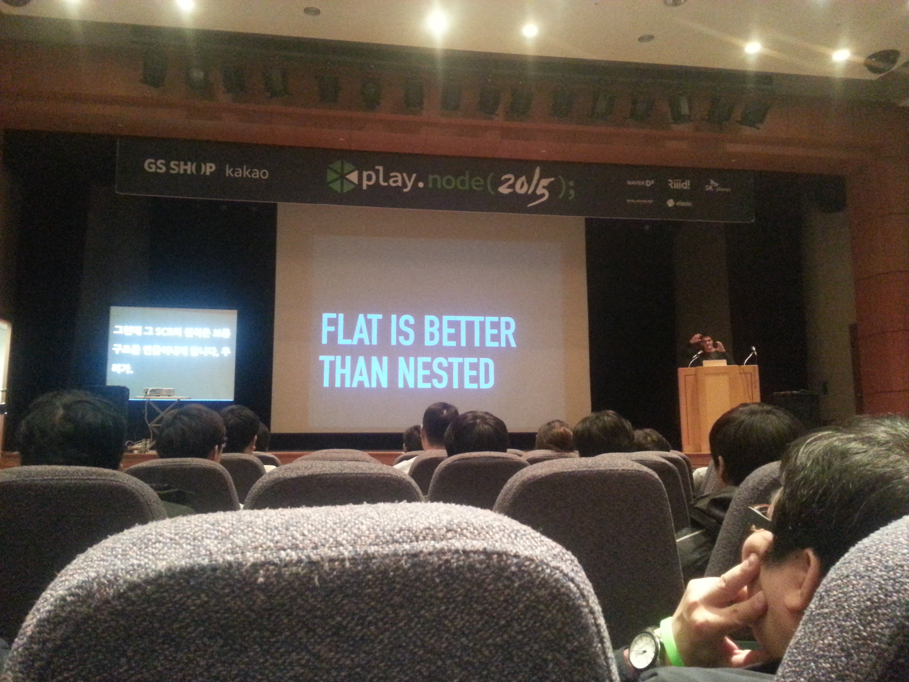
#### (통역기 대신 스크린에 한글로 번역해서 적어주는게 인상적이었다.)

- node js는 수명이 짧아 프레임워크를 만드는 것보다 라이브러리를 만드는 것이 더 도움이 된다.
- 오버엔지니어링을 하지 말자
- 언제나 작동되는 가장 간단한 것으로 만드는게 중요
- 수직적 구조는 관리하기 어렵기 때문에 플랫한게~~
- 프로그램을 만들 때 질문할 것
  - 단순한가?
  - 플랫한가?
- 지나친 모듈화는 피하자.

# npm:>=3
### Speaker - Kat Marchan
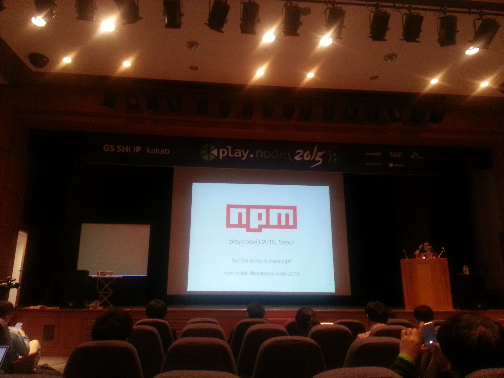

npm은 자바스크립트 패키지 매니저!

gem, pipi의 라이브러리를 합친 것 보다 많은 20만개!

npm V3의 변화 내용  

semver - version 호환성 체크 모듈 major release, minor release, fatch

flat trees
- 기존 2버전에서의 디펜던시 안에 중복 패키지가 있을 경우 중복 설치하던 문제 해결
- 하위 호환성이 지원되면서 중복되는 것들은 트리 위로 이동

npm shrinkwrap
- 다른 컴이던 같은 컴에서 2번 실행하던 결과는 항상 같아야한다!

프론트 엔드도 서폿 예정

ES6 Modules - 아직 모듈 로더가 표준화가 되어 있지 않아서 지켜보고 결정해야할 이야기

# Pipe: 콜백지옥의 또 다른 거짓 선지자
### Speaker - 조승연

### http://kivol.net/playnode.pdf

콜백 지옥..

Synchronus 코드
```javascript
var a = getDataA();
var b = getDataB(a);
var c = getDataC(b);
var d = getDataD(c);
```
Asynchronus 코드
```javascript
getDataA(function(a) {
  getDataB(a, function(b) {
    getDataC(b, function(c) {
      getDataD(c, function(d) {
        everythingIsFinallyEndSoICallback(d);
      });
    });
  });
});
```
1. async
2. promise
3. gulp
3. Generator
5. await es7
6. swint-pipe

### await example
```javascript
var a = await getDataA(),
    b = await getDataB(a),
    c = await getDataC(b),
    d = await getDataD(c);
```
```javascript
var [a,b,c] = await* [
      getDataA(),
      getDataB(),
      getDataC()
    ],
    d = await getDataD(a,b,c);
```

# Gulp로 정적 페이지 생성하기
### Speaker - 박창우


### - Gulp 좋다!
### - markdown 좋지만, asciidoc 도 좋다.


### - 하지만  이젠 webpack?


# Node.js 기반의 대용량 분산 서버 아키텍처 설계 사례
### Speaker - 김요한
### http://www.slideshare.net/JohnKim0331/play-node-conference

CPU Intensive Task는 잘 생각해봐야한다.

페이팔 - Node js는 빠르고, 라인수를 줄일 수 있다.

### 장점
- 서버 시작 / 중지 시간이 상당히 빠르다.
- 배포 시간이 짧다. 하루에도 몇 번씩 배포할 수 있다.
- 하지만 죽는 것도 빠르다?
- 죽으면 어때 다시 살리면 된다?(X)

### 1. 비동기 병렬처리 구현 사례
- 웹페이지 이미지 처리에 좋은 PhantomJS


- CPU core 수 만큼 Single Thread 로 처리
- 개발 생산성, 확장성, 운영의 편의성!!!

### 2. 실시간 메시지 처리 사례

* 아파치 주키퍼
* 배포는 private npm, docker
* hashring
* Grafana를 통한 모니터링

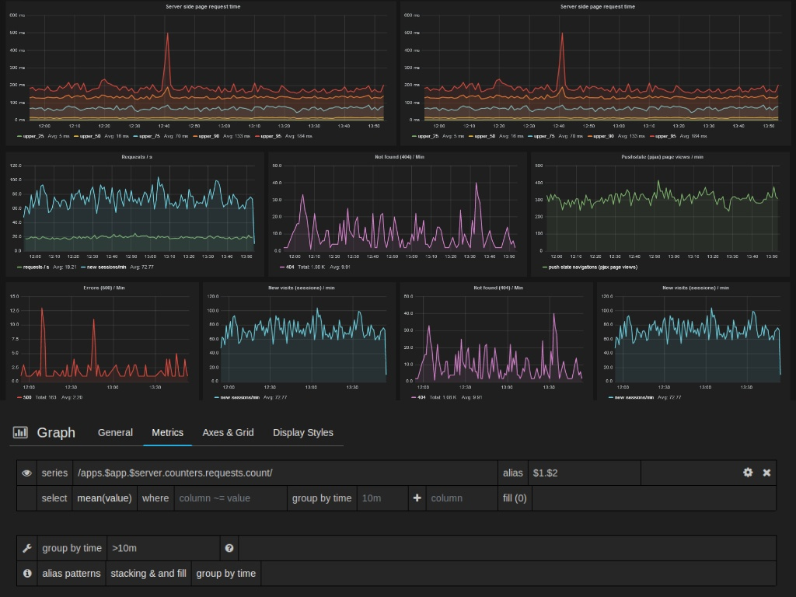

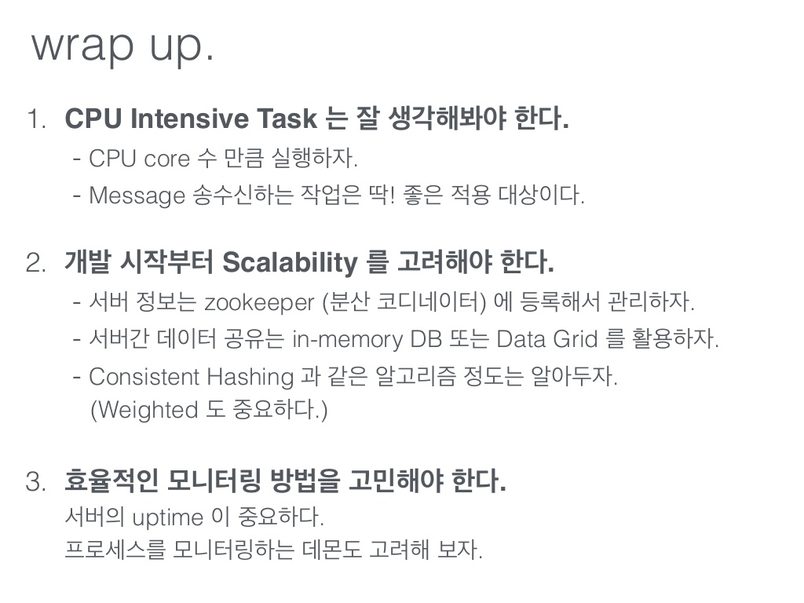

# 시간당 수백만 요청을 처리하는 node.js 서버 운영기  
### Speaker - 김군우

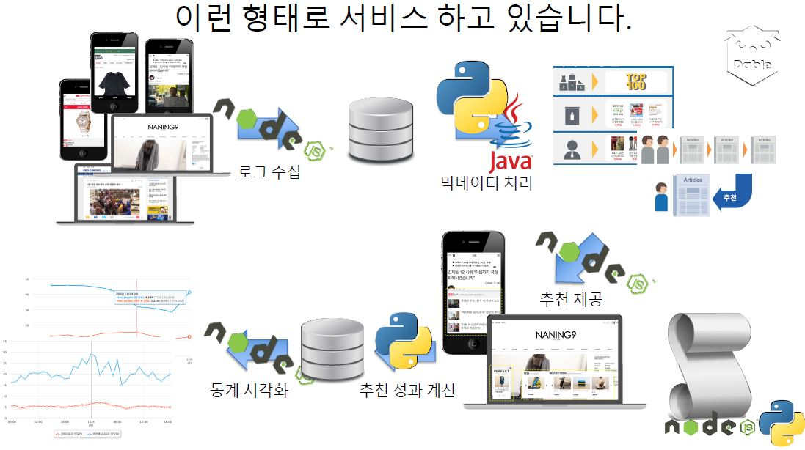

ES6 버전 업 이후 성능 향상.
- 메모리 사용이 반으로 줄었다! (3.75G 중 30% -> 15%)
- CPU 사용량, 응답속도는 크게 달라지지 않았다.ㅠㅜ

```
app.js
route.js
controller/
lib/
front/
test/
views/
public/
```

### 삽질기 1 - 502 Bad Gateway
- 연쇄로 다 죽음 ㅠ

### 삽질기 2 - 원인 모를 서버의 죽음
- request 모듈을 사용할 때 Linux 기본 timeout(2시간) 이 적용되어!!

# Node.js in Flitto  
### Speaker - 이승우
### http://www.slideshare.net/SeungWooLee2/nodejs-in-flitto

Filtto - 집단 지성 번역 플랫폼


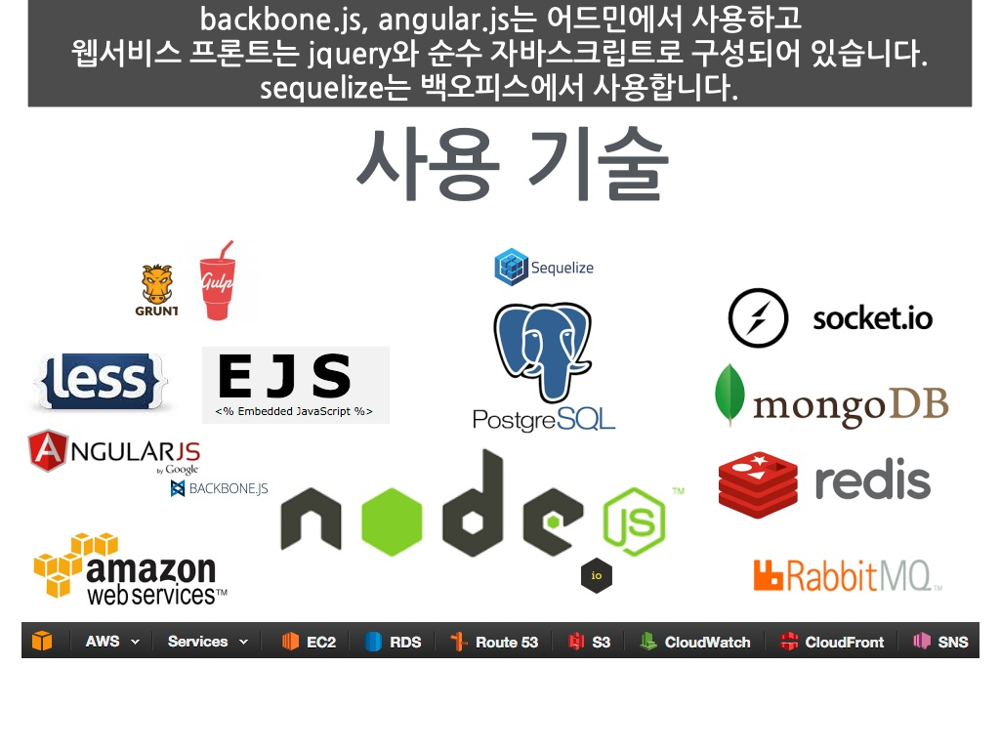

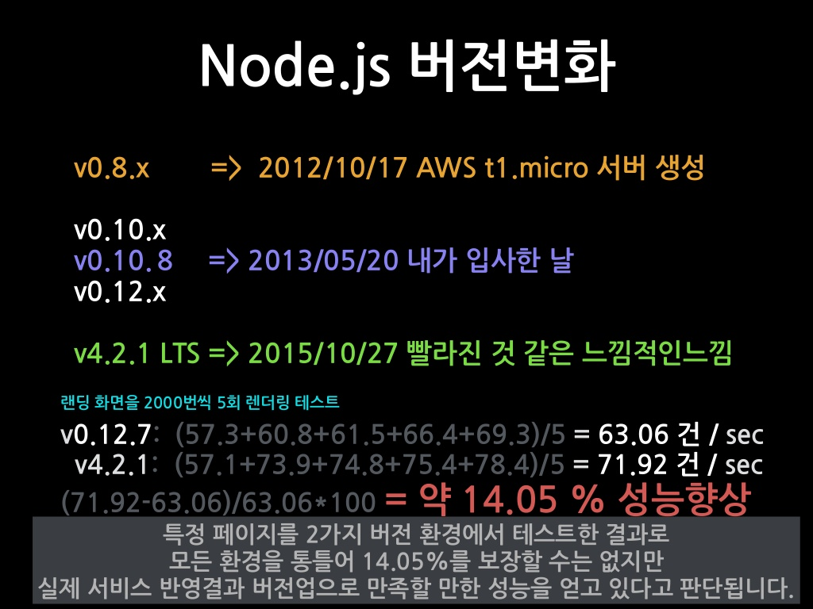

- ES6 버전 업 이후에 14% 정도의 성능 향상

- 환경
  - express 4.8.x
  - 개발 환경은 웹스톰
  - DB 스키마 flyway
  - step / async / promise
  - 테스트는 mocha, should
  - forever -> pm2 로 변경
  - 배포는 jenkins + fabric
  - loggin winston / morgan
  - 웹 푸쉬 소켓 + 레디스 푸쉬
  - 시험적 admin : angular.js, sequelize

# 스프링과 Node.js의 공존  
### Speaker - 장동수
- 발표 자료 : http://www.slideshare.net/iolo/20151112-playnodespringnodejs
- 소스 코드 : https://github.com/iolo/playnode-springboard-demo

이오님 - 울티마 온라인의 주인공 옆에서 기타치는 케릭터

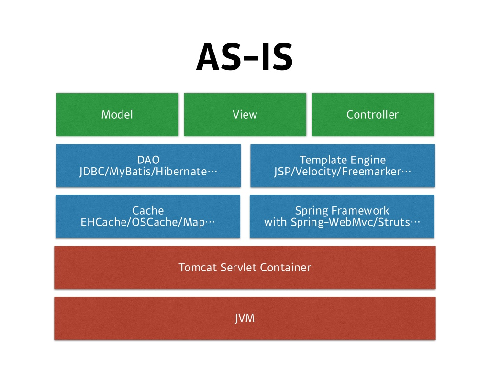

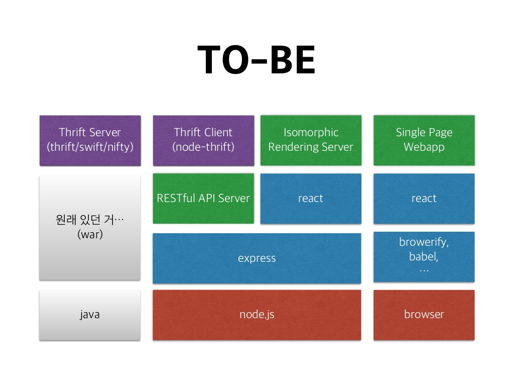

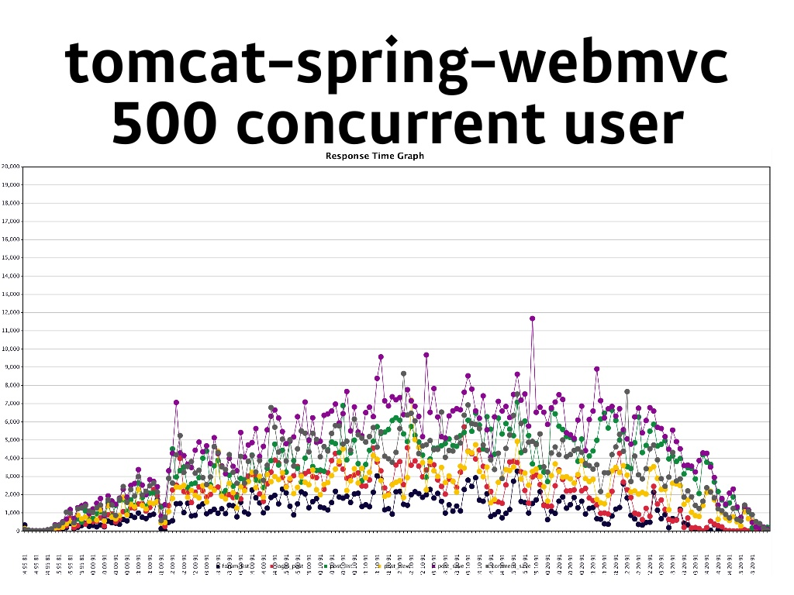

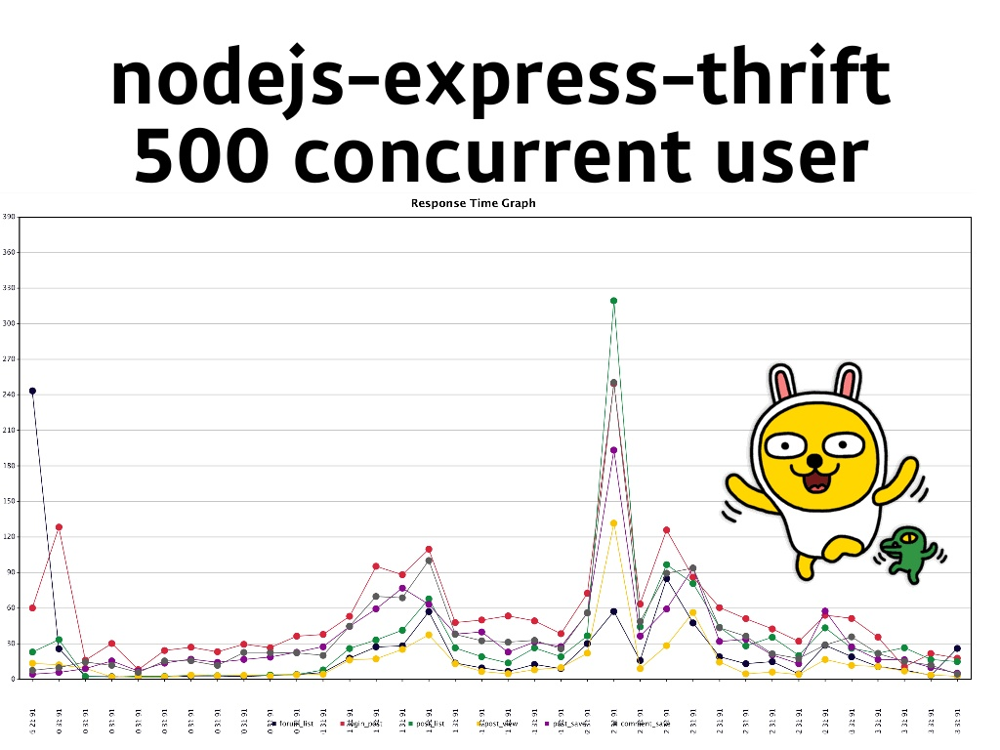

### 명언!!!
- Do not reinvent the wheel, but make it perfect.
- Reivent the wheel, knowing when and how.
- 溫故而知新, 可以爲師矣 (온고이지신, 가이위사의)

# Big Data 세계를 헤엄친 이야기
### Speaker - 이병준

- 발표 자료 : http://slidedeck.io/imjuni/playnode2015


- 25억 건 이상의 데이터
- 6PB 정도의 데이터를 저장
- 일일 사용량은 11TB

### Data Visualization 도구
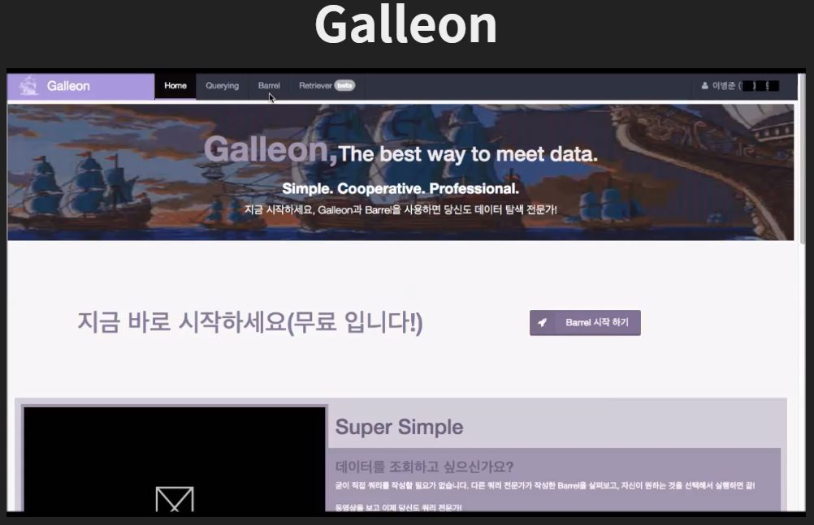


### node-thrift 를 이용한 Hive 접근


# 번외 Thrift

### Thrift 란 ?
##### - The Apache Thrift software framework, for scalable cross-language service development

- 교차언어간에 자연스럽게 통신할수있는  RPC 클라이언트/서버
- 이너리 형태로 통신할 수 있어,네트워크 트래픽을 줄일 수 있다.
- C++, Java, Python, PHP, Ruby, Erlang, Perl, Haskell, C#, Cocoa, JavaScript, Node.js, Smalltalk, OCaml and Delphi and 기타등등
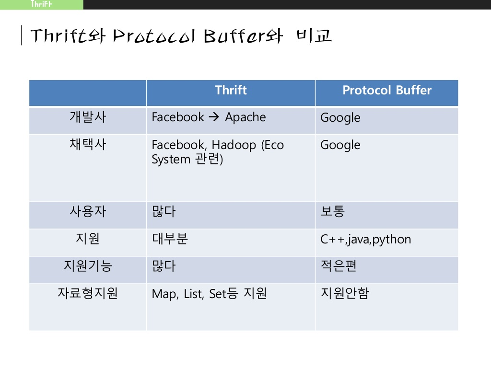

(출처 : http://www.slideshare.net/mrg7211/apache-thrift-51044563)

#### 장점
- 버전닝 지원
- 여러 언어에서 사용 가능하며 언어에 맞도록 소스가 생성되고, 언어간의 Serialization 가능
- Sync, Async Server API 제공
- XML 설정이 필요 없음
- Layer에 맞는 Interface를 사용 및 Customizing 구축 가능
- RPC 기능 제공 (Google Protocol Buffer에는 없는 기능)
- 서버 기능 좋음
   - 서블릿 제공(org.apache.thrift.server.TServlet)
   - 멀티쓰레드 지원 (org.apache.thrift.server.ThreadPoolServer : worker thread 지정)
   - Async 지원 (org.apache.thrift.server. TNonblockingServer : single threaded)
   - Multi-thread Half-Sync/Half-Async지원 : org.apache.thrift.server. THsHaServer
   - Exception을 제공 (Google Protocol Buffer에는 없는 기능)
   - Set, Map 지원 (Google Protocol Buffer에는 없는 기능)

####단점
- 자바로 코드가 생성될 때, Slf4j를 기본적으로 가지고 가며, 내부 코드는 모두 thrift lib가 필요함
- C++의 Server threading part는 Boost에 의존을 가짐
- 자바 쪽 이클립스 플러그인 없음
- Thrift lib의 api가 자주 바뀌어서, 버전 업마다 소스를 좀 보고 코딩해야 함. (인터넷 예제가 거의 없음)
   인터넷 예제랑 달라서, 컴파일 에러 안나게 하는게 귀찮음...
- XML Serialization/Deserialization 기능 없음
- 문서가 확실히 적음 (허허~)
- 생성된 코드가 Google Protocol Buffer에 비해서 보기는 편하지는 않음 (특히 C++)

(출처 : http://brad2014.tistory.com/320)

관련 링크
- http://advent.perl.kr/2011/2011-12-04.html
- http://knight76.tistory.com/entry/Apache-Thrift-%EC%A1%B0%EC%82%AC
- http://knight76.tistory.com/1427
